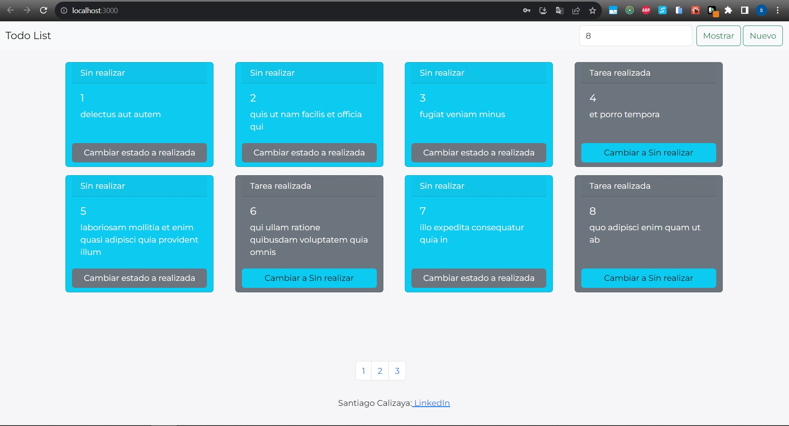

<!-- PROJECT LOGO -->
<br />
<p align="center">
  <a href="https://github.com/ttiago7/user-todo-list">
    
  </a>

  <h3 align="center">ToDo List with React an Redux</h3>

  <p align="center">
    Project description: Todo list to see, create and update your todos 
    <br />
    <a href="#"><strong>Explore the docs »</strong></a>
    <br />
    <br />
    <a href="https://github.com/ttiago7?tab=repositories">View All repositories</a>
    ·
    <a href="https://github.com/ttiago7/user-todo-list">View Frontend repo</a>
  </p>
</p>

<!-- TABLE OF CONTENTS -->
<details open="open">
  <summary><h2 style="display: inline-block">Table of Contents</h2></summary>
  <ol>
    <li>
      <a href="#built-with">Built With</a>      
    </li>
    <li>
      <a href="#getting-started">Getting Started</a>
      <ul>
        <li><a href="#prerequisites">Prerequisites</a></li>
        <li><a href="#installation">Installation</a></li>
      </ul>
    </li>
    <li><a href="#usage">Usage</a></li>
    <li><a href="#contact">Contact</a></li>
  </ol>
</details>

### Built With

-   React
-   Redux, redux-thunk and redux toolkit
-   Axios
-   bootstrap
-   react-hook-form

<!-- GETTING STARTED -->

## Getting Started

Instructions on setting up this project locally. To get a local copy up and running follow these simple steps.

### Prerequisites

-   Node
-   Git
-   NPM or YARN

### Installation

1. Clone the repo
    ```sh
    git clone https://github.com/ttiago7/user-todo-list.git
    ```
2. Open the command line in this repo, into this execute next command
    ```sh
    npm install
    npm start
    ```
3. To login enter user and password (usuario1...usuario10)

<!-- USAGE EXAMPLES -->

## Usage

1. In your browser open http://localhost:3000/
2. the client allow login to see your's todos
   
3. the client allow create new todo
   
4. Update state of a existing todo
   
5. Enter the quantity to display of todos per page
   

<!-- CONTACT -->

## Contact

Calizaya Santiago - [@linkedin-ttiago7](https://www.linkedin.com/in/ttiago7/) - c.ttiago7@gmail.com
